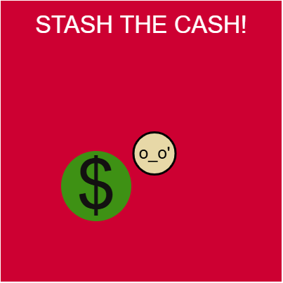
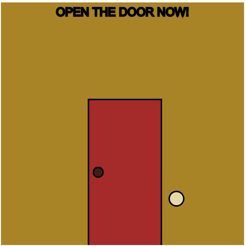
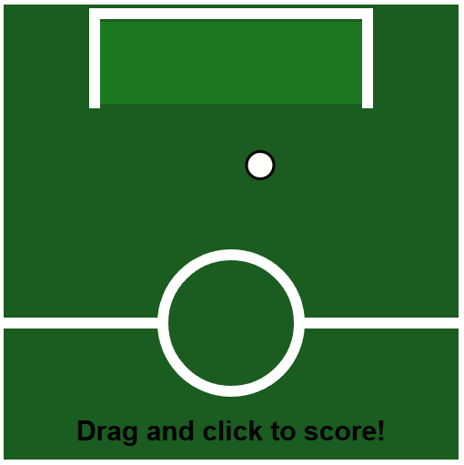

# **Marko's Island**

This place keeps information about my prototyping projects

### *Social Media*

[Instagram](https://www.instagram.com/marko.polo03/?hl=en)

### *My reflective journal*

[Link to my reflective journal](./journal.md)

## *Assignment Prototypes*

[Online](https://polom2.github.io/cart253/topics/Prototypes/instructions-prototype-1/index.html)

[Code](https://github.com/PoloM2/cart253/blob/main/topics/Prototypes/instructions-prototype-1/js/script.js)

[Online](https://polom2.github.io/cart253/topics/Prototypes/instructions-prototype-2/index.html)

[Code](https://github.com/PoloM2/cart253/blob/main/topics/Prototypes/instructions-prototype-2/js/script.js)

[Online](https://polom2.github.io/cart253/topics/Prototypes/instructions-prototype-3/index.html)

[Code](https://github.com/PoloM2/cart253/blob/main/topics/Prototypes/instructions-prototype-3/js/script.js)

### [Link to my reflective journal](./journal.md)

## *Variable Prototypes*

[Online](https://polom2.github.io/cart253/topics/Prototypes-variables/variables-prototype-1/)

[Code](https://github.com/PoloM2/cart253/blob/main/topics/Prototypes-variables/variables-prototype-1/js/script.js)

[Online](https://polom2.github.io/cart253/topics/Prototypes-variables/variables-prototype-2/)

[Code](https://github.com/PoloM2/cart253/blob/main/topics/Prototypes-variables/variables-prototype-2/js/script.js)

[Online](https://polom2.github.io/cart253/topics/Prototypes-variables/variables-prototype-3/)

[Code](https://github.com/PoloM2/cart253/blob/main/topics/Prototypes-variables/variables-prototype-3/js/script.js)

### [Link to my reflective journal](./journal.md)

## *Conditional Prototypes*

[Online](https://polom2.github.io/cart253/topics/Prototypes-conditionals/conditionals-prototype-1/)

[code](https://github.com/PoloM2/cart253/blob/main/topics/Prototypes-conditionals/conditionals-prototype-1//js/script.js)

[Online](https://polom2.github.io/cart253/topics/Prototypes-conditionals/conditionals-prototype-2/)

[code](https://github.com/PoloM2/cart253/blob/main/topics/Prototypes-conditionals/conditionals-prototype-2//js/script.js)

[Online](https://polom2.github.io/cart253/topics/Prototypes-conditionals/conditionals-prototype-3/)

[code](https://github.com/PoloM2/cart253/blob/main/topics/Prototypes-conditionals/conditionals-prototype-3//js/script.js)

### [Link to my reflective journal](./journal.md)