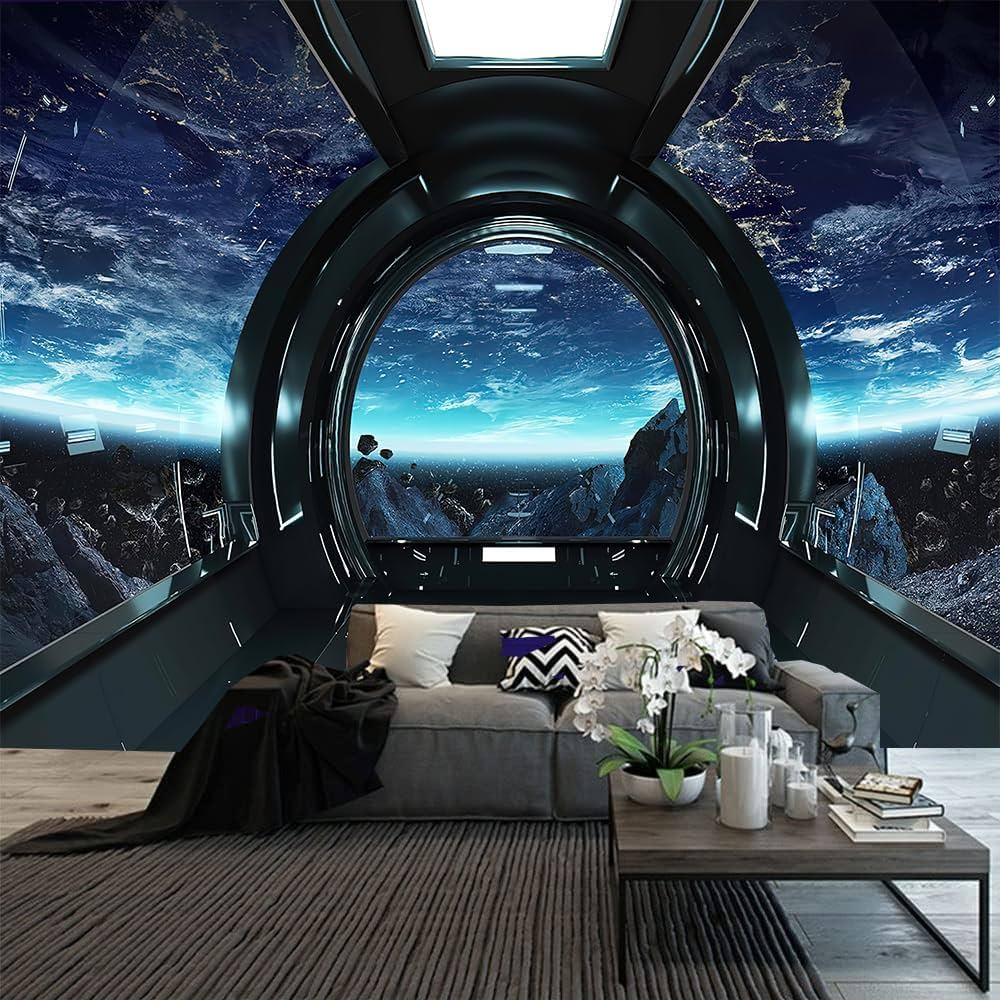
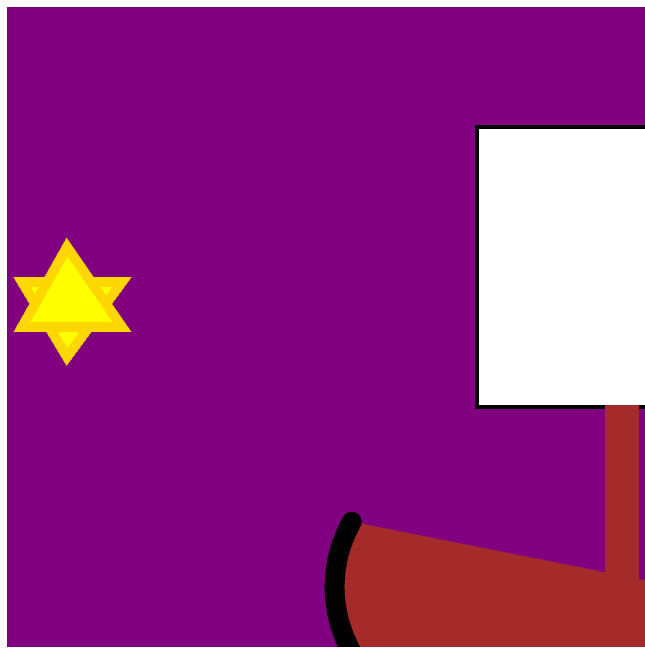
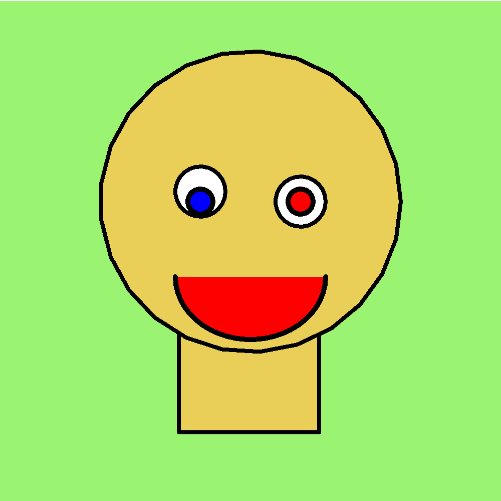
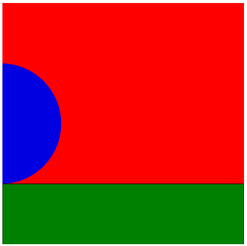
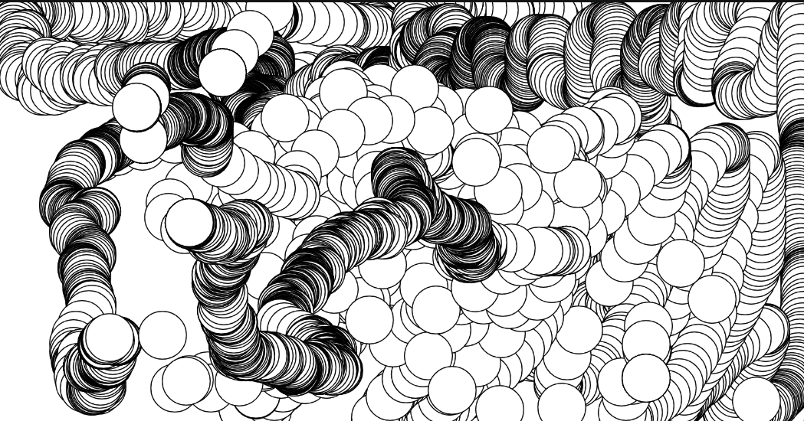
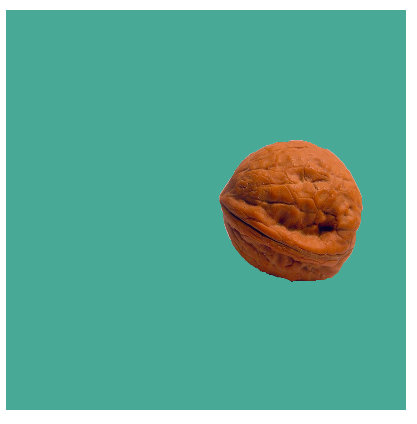
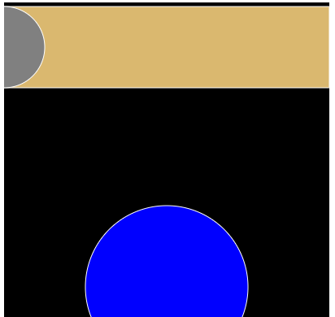

# **Marko's orbiter**

This place keeps information about my prototyping projects

## *Social Media*

[Instagram](https://www.instagram.com/marko.polo03/?hl=en)

## *My reflective journal*

[Link to my reflective journal](./journal.md)

## *Assignment Prototypes*

[Prototype 1](https://polom2.github.io/cart253/topics/Prototypes/instructions-prototype-1/index.html)

[Prototype 2](https://polom2.github.io/cart253/topics/Prototypes/instructions-prototype-2/index.html)

[Prototype 3](https://polom2.github.io/cart253/topics/Prototypes/instructions-prototype-3/index.html)

[Link to my reflective journal](./journal.md)

## *Variable Prototypes*

[Prototype 1](https://polom2.github.io/cart253/topics/Prototypes-variables/variables-prototype-1/index.html)

[Prototype 2](https://polom2.github.io/cart253/topics/Prototypes-variables/variables-prototype-2/)

[Prototype 3](https://polom2.github.io/cart253/topics/Prototypes-variables/variables-prototype-3/)

[link to my code]()

[Link to my reflective journal](./journal.md) 