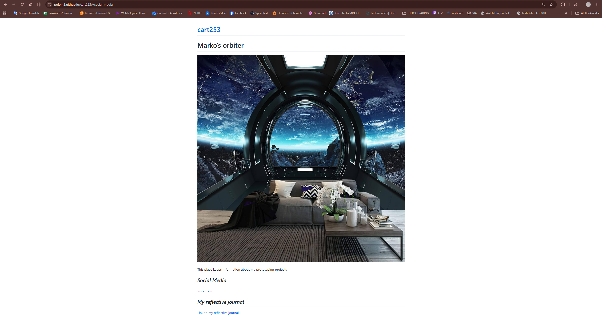

# Reflective Journal

## 15 September 2026

While making my website with Markdown and GitHub, I was surprised that the website was coming to life from my README.md file. I thought I would have to code a lot more or do something more complicated. It was actually simpler than I expected.

I learned how Markdown works and how important syntax is. Small mistakes with symbols or file pathways can change how things appear on the website. I think it is cool that something as simple as a Markdown file can create a website, but there is still so much more I can learn and improve.

The most difficult part was understanding file pathways and how GitHub connects with VS Code. I also found committing and pushing confusing at first. I had to understand why pushing changes is important and how it keeps my work updated. The GitHub Pages settings were also a little difficult to understand.

This project made me want to learn more about coding and web design. I feel genuinely excited because I can see myself making my website more creative and personal in the future. I hope people who visit my website feel curious about my work and get a better idea of me as an artist and creator. My aspiration is to keep learning and eventually make websites that are more interactive and unique.

Marko

