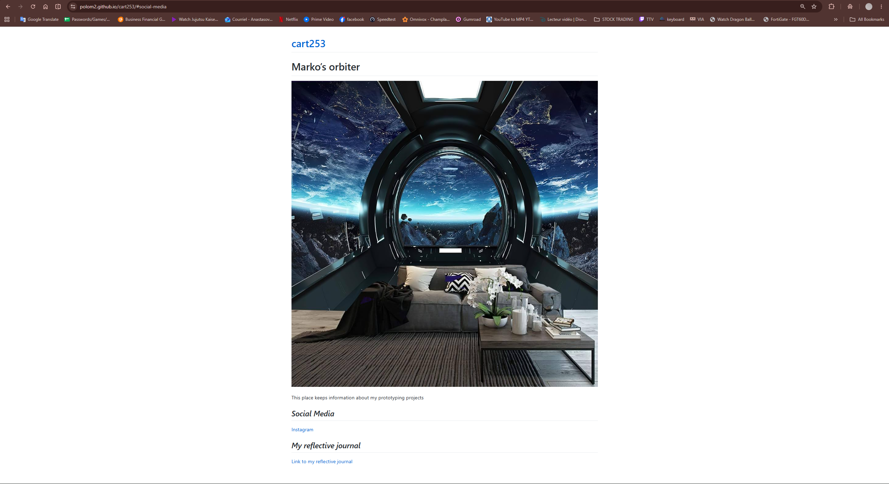

# Reflective Journal 1

## 15 September 2026

While making my website with Markdown and GitHub, I was surprised that the website was coming to life from my README.md file. I thought I would have to code a lot more or do something more complicated. It was actually simpler than I expected.

I learned how Markdown works and how important syntax is. Small mistakes with symbols or file pathways can change how things appear on the website. I think it is cool that something as simple as a Markdown file can create a website, but there is still so much more I can learn and improve.

The most difficult part was understanding file pathways and how GitHub connects with VS Code. I also found committing and pushing confusing at first. I had to understand why pushing changes is important and how it keeps my work updated. The GitHub Pages settings were also a little difficult to understand.

This project made me want to learn more about coding and web design. I feel genuinely excited because I can see myself making my website more creative and personal in the future. I hope people who visit my website feel curious about my work and get a better idea of me as an artist and creator. My aspiration is to keep learning and eventually make websites that are more interactive and unique.

Marko

# Reflective Journal 2

## 22 September 2026

I learned a lot more about coding while working on my prototypes. The variables challenge was definitely tougher when I wanted to make things more “spicy” and add more interesting effects. It made me understand better how variables can control different parts of a project.

Making multiple prototypes also helped me deepen my skillset and understand JavaScript a bit more, especially JS draws and functions. Each prototype gave me a chance to try something different and learn from what did not work.

I faced a lot of problems and setbacks while working, but the troubleshooting actually helped me understand the principles and syntax better. Instead of just following instructions, I had to figure out why something was not working and find a way to fix it. This helped me remember the code better.

I also learned more about WebGL and how code can create visual and interactive results. I think it is cool that a few lines of code can completely change what happens on the screen. Seeing my prototypes improve through each version made me more interested in coding.

For the future, I want to keep experimenting with JavaScript, WebGL, and interactive projects. I want to become more comfortable with coding so I can create more complex ideas without being stuck every time something does not work.

Marko

# Reflective Journal 3

## 29 September 2026

I learned more about coding through my prototypes, especially syntax and variables. I also learned how to add images using different let variables and functions.

There was definitely a lot of frustration when things did not work, but troubleshooting helped me understand the code better. It was sometimes annoying, but figuring out the problems made it worth it.

Overall, I learned a lot more about JavaScript and how different functions work together. It was challenging but also fun to see my ideas actually work on screen.

Marko

# Reflective Journal 4

I learned more about conditionals and how text can be added to my prototypes. I learned how to use text functions to add instructions and small details to the screen, like the “STASH THE CASH!” header and the face on the character. It made my prototypes feel more complete and interactive.

I also learned more about how different parts of the code work together. Using variables, functions, and conditionals can make the prototype react and change depending on what is happening. It was still confusing at times, but I am getting better at understanding what each part of the code is doing.

Another thing I learned was how to properly use the right file paths for links to my code and online drawings. I had some problems with paths before, so understanding how to connect everything properly made things easier.

Overall, I am slowly becoming more comfortable with JavaScript and making interactive drawings. I still have a lot to learn, but troubleshooting and experimenting with different ideas is helping me understand the code better.

Marko